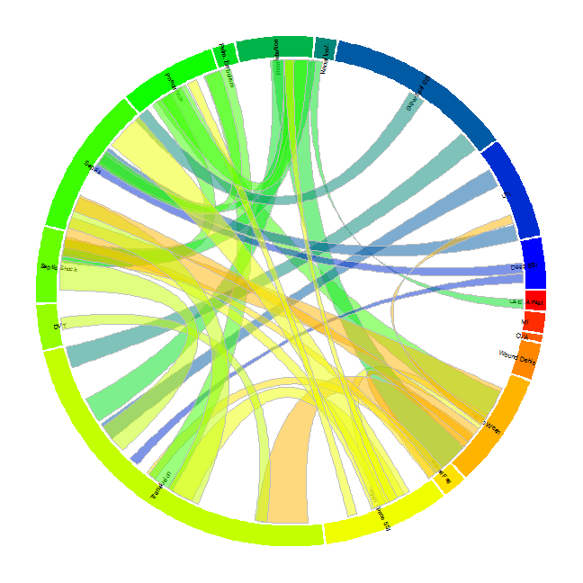

Visualizing Surgical Complications
========================================================

The ACS NSQIP database is an interhospital dataset that keeps track of outcomes for surgical patients.

Code
=======
Data Preparation
-------------------
Setting up the data in the correct way is essential before plotting. We need to main data sets. The first is a data set showing each complication and the frequency of that complication. This will be used to create the outer circle of the plot and to designate the size of each of the segments
###Frequency by complication

```r
setwd("C:/Users/sdperez.EMORYUNIVAD/Documents/GitHub/CirclizeComplications")
library(xlsx)
Comps <- read.xlsx2("Complications.xls", 1, stringsAsFactors = FALSE)
# names(Comps) sum(as.numeric(Comps$COUNT))#total General Surgery patients
# in set


# Let's count the number of complications of each type
x <- list()
for (i in 1:21) {
    x[[i]] <- min(by(as.numeric(Comps$COUNT), Comps[, i], FUN = sum))
}
Comp.Tab <- data.frame(Complication = names(Comps)[1:21], Count = unlist(x))
# sum(Comp.Tab$Count)#number

# the folling three complications had so few numbers they hard to see on
# the plot so we excluded them.
CompPlot <- Comp.Tab[-c(13, 14, 18), ]
CompPlot$Complication <- factor(CompPlot$Complication)
CompPlot$labls <- c("Superficial SSI", "Deep SSI", "Organ Space SSI", "Wound Dehis", 
    "Pneumonia", "Reintubation", "Pulm. Embolism", "Fail to Wean", "Renal Insf.", 
    "Renal Fail", "UTI", "CVA", "Card. Arrest", "MI", "Transfusion", "DVT", 
    "Sepsis", "Septic Shock")
```

###Frequency by Combination of Complications
The second dataset will describe what is the frequency of patients that have each of the two way combinations of complications. In other words, how many patients had a heart attach AND a superficial site infection? This dataset will be used to create the links between the segments of the outer circle.
Create file with information about links


```r
# Create a blank data frame for data
links1 <- data.frame(Comp1 = vector("character", 441), Comp2 = vector("character", 
    441), Count = numeric(441), stringsAsFactors = F)
# The 'Comps' data set includes all possible combination of complications.
# The following calculates for each *2-WAY COMBINATION* of complications
# the total occurrences
for (i in 1:21) {
    for (j in 1:21) {
        index <- Comps[, i] != "No Complication" & Comps[, j] != "No Complication"
        Comps2 <- Comps[index, ]
        n = 21 * (i - 1) + j
        links1$Count[n] <- sum(as.numeric(Comps2$COUNT))
        links1$Comp1[n] <- names(Comps2)[i]
        links1$Comp2[n] <- names(Comps2)[j]
    }
}

# not all 2-way combinations are needed since they are repeated in the
# data. we need to delete the duplicates. list of only the combinations we
# want to use(delete unneeded rows)
comblist <- t(combn(as.character(CompPlot$Complication), 2))
to.keep <- paste(links1$Comp1, links1$Comp2, sep = "") %in% paste(comblist[, 
    1], comblist[, 2], sep = "")
# sum(to.keep)#check there are only 153 combinations

links2 <- links1[to.keep, ]
links3 <- merge(links2, Comp.Tab, by.x = "Comp1", by.y = "Complication")
links4 <- merge(links3, Comp.Tab, by.x = "Comp2", by.y = "Complication")
names(links4)[4] <- "den1"
names(links4)[5] <- "den2"

# divide the complications by each of the denominators this is because the
# thickness of the link needs to be between 0 and 1.
links4$Comp1.perc <- links4$Count/links4$den1
links4$Comp2.perc <- links4$Count/links4$den2
```


Create Plot
--------------
###Plot Outer Circle
The first step is to set some options and plot the outer circle. The size of the segments is determined by the count of the complication.


```r
op <- par(no.readonly = TRUE)
library(circlize)
# library(RColorBrewer) display.brewer.pal(21, 'Purples')
# display.brewer.pal(21, 'PuBu')

# col <- brewer.pal(9, 'PuBu') colp <- brewer.pal(9, 'Purples')
# col[3]<-'#3F007D' col[4]<-'#6A51A3'

# col2<-rep(col[3:9],3)
colfunc <- colorRampPalette(c("red", "yellow", "green", "blue"))
# levels(CompPlot$Complication)
# cbind(CompPlot$Complication,CompPlot$Count)
ord <- order(CompPlot$Complication)

par(mar = c(4, 4, 4, 4))
circos.clear()
circos.par(cell.padding = c(0, 0, 0, 0), gap.degree = 0.5)
# track.margin=c(.2,.2))
circos.initialize(CompPlot$Complication, xlim = c(0, 1), sector.width = c(CompPlot$Count[ord]))
circos.trackPlotRegion(ylim = c(0, 1), factors = CompPlot$Complication, track.height = 0.08, 
    bg.col = colfunc(18), bg.border = NA, panel.fun = function(x, y) {
        i = get.cell.meta.data("sector.numeric.index")
        name = get.cell.meta.data("sector.index")
        xlim = get.cell.meta.data("xlim")
        if (i %in% 8:13) 
            dir = "vertical_left" else dir = "vertical_right"
        circos.text(x = 0.5, y = 1.5, labels = CompPlot$labls[ord][i], direction = dir, 
            cex = 0.6)
    })
```

```
## Note: 1 point is out of plotting region in sector 'CDARREST', track '1'.
## Note: 1 point is out of plotting region in sector 'CDMI', track '1'.
## Note: 1 point is out of plotting region in sector 'CNSCVA', track '1'.
## Note: 1 point is out of plotting region in sector 'DEHIS', track '1'.
## Note: 1 point is out of plotting region in sector 'FAILWEAN', track '1'.
## Note: 1 point is out of plotting region in sector 'OPRENAFL', track '1'.
## Note: 1 point is out of plotting region in sector 'ORGSPCSSI', track '1'.
## Note: 1 point is out of plotting region in sector 'OTHBLEED', track '1'.
## Note: 1 point is out of plotting region in sector 'OTHDVT', track '1'.
## Note: 1 point is out of plotting region in sector 'OTHSESHOCK', track '1'.
## Note: 1 point is out of plotting region in sector 'OTHSYSEP', track '1'.
## Note: 1 point is out of plotting region in sector 'OUPNEUMO', track '1'.
## Note: 1 point is out of plotting region in sector 'PULEMBOL', track '1'.
## Note: 1 point is out of plotting region in sector 'REINTUB', track '1'.
## Note: 1 point is out of plotting region in sector 'RENAINSF', track '1'.
## Note: 1 point is out of plotting region in sector 'SUPINFEC', track '1'.
## Note: 1 point is out of plotting region in sector 'URNINFEC', track '1'.
## Note: 1 point is out of plotting region in sector 'WNDINFD', track '1'.
```

```r


### Plot Links Now create the links between the segments

for (k in 1:nrow(links4)) {
    if (links4$Count.x[k] > 340) {
        start = runif(1)
        end = runif(1)
        circos.link(links4$Comp1[k], c(start, start + links4$Comp1.perc[k]), 
            links4$Comp2[k], c(end, end + links4$Comp2.perc[k]), top.ratio = 0.48, 
            top.ratio.low = 0.5, col = paste(colfunc(153)[k], "80", sep = ""))
    }
}
```

 

```r
circos.clear()
par(op)
```
